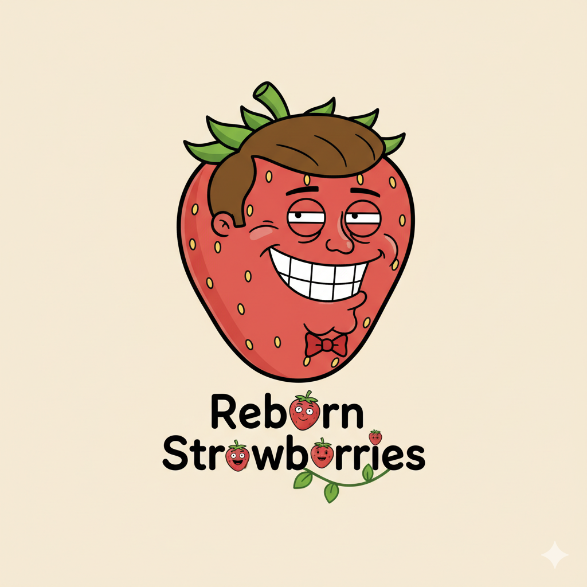

<div align="center">
  
  <h1>Stubborn Strawberry</h1>
  <p>An AI-powered knowledge management system that combines your personal documents with external data sources. Built with FastAPI, Next.js, and PostgreSQL with vector search capabilities.</p>
</div>

## Features

- **🤖 AI Chat Interface** - Ask questions and get cited answers from your knowledge base
- **📁 Document Management** - Upload and organize documents with intelligent chunking
- **🔍 Hybrid Search** - Combines semantic vector search with full-text search using Reciprocal Rank Fusion
- **🎙️ Podcast Generation** - Convert documents and conversations into audio podcasts
- **📚 Study Mode** - Generate flashcards and MCQs from your documents
- **🔌 External Connectors** - Integrate with GitHub, Notion, and Linear
- **🏠 Self-Hosted** - Complete control over your data with local deployment
- **🔐 Multi-Tenant** - Workspace isolation with user authentication (JWT/OAuth)

## Supported File Formats

- **Documents**: `.pdf`, `.doc`, `.docx`
- **Presentations**: `.pptx`
- **Audio/Video**: `.mp3`, `.m4a`, `.webm`

## External Connectors

Currently supported integrations:
- **GitHub** - Repository content and issues
- **Notion** - Pages and databases
- **Linear** - Issues and projects

## Tech Stack

### Backend
- **FastAPI** - Python web framework
- **PostgreSQL + pgvector** - Database with vector search
- **SQLAlchemy** - ORM and database migrations
- **Celery + Redis** - Background task processing
- **LangChain** - AI agent framework
- **LiteLLM** - Multi-provider LLM integration

### Frontend
- **Next.js 15** - React framework with App Router
- **TypeScript** - Type-safe development
- **Tailwind CSS** - Utility-first styling
- **Shadcn UI** - Component library

## Quick Start

### Prerequisites
- Docker and Docker Compose
- API keys for LLM provider (OpenAI, Anthropic, etc.)

### Installation

1. Clone the repository:
```bash
git clone https://github.com/longle325/CoverGoAIHakathon2025.git
cd CoverGoAIHakathon2025
```

2. Configure environment variables:
```bash
# Backend
cp backend/.env.example backend/.env

# Frontend
cp frontend/.env.example frontend/.env
```

3. Start the services:
```bash
docker-compose up -d
```

4. Access the application:
- Frontend: http://localhost:3000
- Backend API: http://localhost:8000
- pgAdmin: http://localhost:5050

## Architecture

- **Frontend (Next.js)** - Server-side rendering and client-side interactivity
- **Backend API (FastAPI)** - RESTful API with async operations
- **Database (PostgreSQL)** - Relational data with vector embeddings
- **Task Queue (Celery)** - Asynchronous document processing
- **Cache/Broker (Redis)** - Task queue and result storage

## Development

See [CONTRIBUTING.md](CONTRIBUTING.md) for development guidelines.

## License

See [LICENSE](LICENSE) for details.

## Contributing

Contributions are welcome! Please open an issue or submit a pull request.
