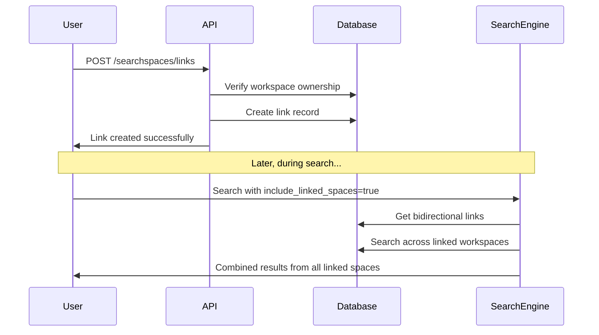
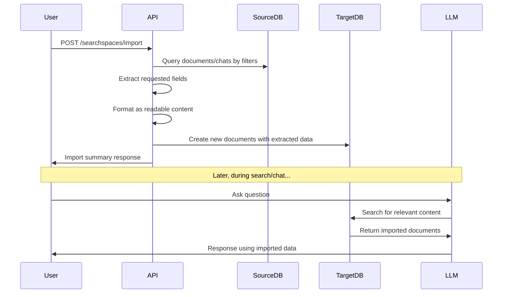

# Workspace Integration System Documentation

## Overview

SurfSense provides two complementary approaches for workspace integration:

1. **Workspace Linking** - Virtual connections that enable cross-workspace search
2. **Workspace Import** - Physical data extraction and copying between workspaces

Both systems allow users to leverage information across multiple workspaces while maintaining data organization and security.

## System Architecture

### Database Schema

```sql
-- SearchSpace Links Table (for linking feature)
CREATE TABLE searchspace_links (
    id INTEGER PRIMARY KEY,
    source_space_id INTEGER NOT NULL,  -- Workspace that links to another
    target_space_id INTEGER NOT NULL,  -- Workspace being linked to
    created_at TIMESTAMP NOT NULL,

    FOREIGN KEY (source_space_id) REFERENCES searchspaces(id) ON DELETE CASCADE,
    FOREIGN KEY (target_space_id) REFERENCES searchspaces(id) ON DELETE CASCADE,
    UNIQUE(source_space_id, target_space_id),
    CHECK(source_space_id != target_space_id)
);

-- Documents Table (stores both original and imported documents)
CREATE TABLE documents (
    id INTEGER PRIMARY KEY,
    title VARCHAR NOT NULL,
    document_type VARCHAR NOT NULL,
    document_metadata JSON,
    content TEXT NOT NULL,
    content_hash VARCHAR UNIQUE NOT NULL,
    search_space_id INTEGER NOT NULL,
    created_at TIMESTAMP NOT NULL,

    FOREIGN KEY (search_space_id) REFERENCES searchspaces(id) ON DELETE CASCADE
);
```

### Key Components

- **Database Models**: `/app/db.py` (SearchSpace, Document, Chat, searchspace_links)
- **API Routes**: `/app/routes/search_spaces_routes.py`
- **Schemas**: `/app/schemas/search_space.py`
- **Search Logic**: `/app/retriver/chunks_hybrid_search.py` & `/app/retriver/documents_hybrid_search.py`

## Feature 1: Workspace Linking

### Purpose
Creates virtual connections between workspaces to enable cross-workspace search without data duplication.

### API Endpoints

#### 1. Link Two Workspaces
```http
POST /searchspaces/links
Content-Type: application/json

{
    "source_space_id": 1,
    "target_space_id": 2
}
```

**Response:**
```json
{
    "message": "SearchSpaces linked successfully",
    "source_space": "Research Workspace",
    "target_space": "Archive Workspace"
}
```

#### 2. Unlink Workspaces
```http
DELETE /searchspaces/links/{source_space_id}/{target_space_id}
```

#### 3. View Workspace Links
```http
GET /searchspaces/{search_space_id}/links
```

**Response:**
```json
{
    "search_space": {
        "id": 1,
        "name": "Main Workspace",
        "description": "Primary workspace"
    },
    "linked_to": [
        {
            "id": 2,
            "name": "Research Workspace",
            "description": "Research documents",
            "created_at": "2025-01-25T10:00:00Z"
        }
    ],
    "linked_from": [
        {
            "id": 3,
            "name": "Archive Workspace",
            "description": "Archived content",
            "created_at": "2025-01-25T09:00:00Z"
        }
    ]
}
```

### Linking Flow



### Bidirectional Search Logic

When `include_linked_spaces=True`, the system performs bidirectional link resolution:

```python
# Get outgoing links: spaces this workspace links TO
outgoing_links = SELECT target_space_id
                FROM searchspace_links
                WHERE source_space_id = current_workspace_id

# Get incoming links: spaces that link TO this workspace
incoming_links = SELECT source_space_id
                FROM searchspace_links
                WHERE target_space_id = current_workspace_id

# Search across all connected spaces
all_space_ids = [current_workspace_id] + outgoing_links + incoming_links
search_results = search_documents_in_spaces(all_space_ids)
```

## Feature 2: Workspace Import

### Purpose
Extracts specific data fields from source workspaces and creates new documents in target workspaces for LLM processing.

### API Endpoint

```http
POST /searchspaces/import
Content-Type: application/json

{
    "source_space_id": 1,
    "target_space_id": 2,
    "import_fields": ["messages", "content", "titles", "metadata"],
    "import_document_types": ["FILE", "CRAWLED_URL", "SLACK_CONNECTOR"],
    "limit": 50
}
```

### Import Fields

| Field | Source | Description |
|-------|--------|-------------|
| `titles` | Documents | Document titles as readable text |
| `content` | Documents | Full document content |
| `metadata` | Documents | Document metadata as key-value pairs |
| `messages` | Chats | Chat conversations formatted as dialogue |

### Import Process Flow



### Import Response

```json
{
    "message": "Successfully imported 5 documents and 2 chat conversations from 'Source Workspace' to 'Target Workspace'",
    "imported_documents": 5,
    "imported_messages": 2,
    "imported_items": [
        {
            "type": "document",
            "original_id": 123,
            "title": "Research Paper",
            "extracted_fields": ["titles", "content", "metadata"]
        },
        {
            "type": "chat",
            "original_id": 456,
            "title": "Project Discussion",
            "extracted_fields": ["messages"]
        }
    ]
}
```

### Data Formatting Examples

#### Document Import Format
```
Title: Machine Learning Best Practices

Content: This document covers essential ML practices including data preprocessing, model selection, and evaluation metrics...

Metadata:
author: John Smith
publication_date: 2024-12-15
category: technical_guide
url: https://example.com/ml-guide
```

#### Chat Import Format
```
Chat: Weekly Team Standup

User: What are our priorities for this sprint?
Assistant: Based on our roadmap, we should focus on completing the authentication system and starting the mobile app development.
User: Sounds good. Any blockers?
Assistant: The API rate limiting needs to be implemented before we can proceed with load testing.
```

## Comparison: Linking vs Import

| Aspect | Workspace Linking | Workspace Import |
|--------|------------------|------------------|
| **Data Storage** | Virtual (no duplication) | Physical (creates copies) |
| **Real-time Updates** | ✅ Immediate | ❌ Static snapshot |
| **Storage Usage** | Minimal | Higher |
| **Search Performance** | Dynamic queries | Fast (indexed content) |
| **Use Case** | Live collaboration | Data consolidation |
| **LLM Processing** | On-demand search | Direct document access |

## Usage Scenarios

### Scenario 1: Research Project (Linking)
```
Main Project Workspace ←→ Reference Library Workspace
                      ←→ Team Notes Workspace
```
- **Benefit**: Always access latest research without duplication
- **API**: Use `include_linked_spaces=true` in search queries

### Scenario 2: Monthly Report (Import)
```
Monthly Report Workspace ← Import from:
                          ├── Sales Data Workspace
                          ├── Marketing Workspace
                          └── Support Tickets Workspace
```
- **Benefit**: Static snapshot for historical reporting
- **API**: `POST /searchspaces/import` with specific date ranges

### Scenario 3: Knowledge Base (Hybrid)
```
Knowledge Base Workspace ← Import: FAQs, Procedures
                        ←→ Link: Live Documentation, Updates
```

## Security & Validation

### Access Control
- ✅ **Ownership Verification**: Both source and target workspaces must belong to user
- ✅ **Permission Checks**: No cross-user workspace access
- ✅ **Transaction Safety**: Atomic operations with rollback on failure

### Data Integrity
- ✅ **Unique Constraints**: Prevent duplicate links
- ✅ **Referential Integrity**: Cascade deletion of links when workspaces deleted
- ✅ **Content Hashing**: Prevent duplicate imported documents

### Error Handling

| Error Scenario | HTTP Status | Response |
|---------------|-------------|----------|
| Source workspace not found | 404 | "Source SearchSpace with ID {id} not found or not accessible" |
| Target workspace not found | 404 | "Target SearchSpace with ID {id} not found or not accessible" |
| Self-linking/importing | 400 | "Cannot link/import workspace to itself" |
| Duplicate link | 400 | "Link already exists between these SearchSpaces" |
| Invalid import fields | 400 | "Invalid import_fields: {fields}" |
| Database error | 500 | "Failed to {operation}: {error}" |

## Performance Considerations

### Linking Performance
- **Query Optimization**: Uses indexed joins and `IN` clauses
- **Memory Usage**: Links resolved at query time (no caching)
- **Network**: Single database query for bidirectional resolution

### Import Performance
- **Batch Processing**: Imports multiple documents in single transaction
- **Content Limits**: Configurable limits prevent memory issues
- **Indexing**: Imported documents automatically indexed for search

### Optimization Tips
1. **Limit Import Size**: Use `limit` parameter for large workspaces
2. **Filter Document Types**: Specify `import_document_types` to reduce noise
3. **Monitor Link Chains**: Avoid excessive linking that dilutes search relevance

## Implementation Details

### Database Queries

#### Bidirectional Link Resolution
```sql
-- Get all linked workspace IDs (both directions)
WITH linked_spaces AS (
    SELECT target_space_id as space_id
    FROM searchspace_links
    WHERE source_space_id = :current_space_id

    UNION

    SELECT source_space_id as space_id
    FROM searchspace_links
    WHERE target_space_id = :current_space_id
)
SELECT * FROM documents
WHERE search_space_id IN (
    SELECT :current_space_id
    UNION
    SELECT space_id FROM linked_spaces
);
```

#### Import with Field Extraction
```sql
-- Extract documents with specific fields
SELECT id, title, content, document_metadata, document_type
FROM documents
WHERE search_space_id = :source_space_id
AND document_type = ANY(:document_types)
LIMIT :limit_count;

-- Extract chat messages
SELECT id, title, messages, type
FROM chats
WHERE search_space_id = :source_space_id
LIMIT :limit_count;
```

### Field Extraction Logic

```python
# Document field extraction
extracted_content = ""
if "titles" in import_fields:
    extracted_content += f"Title: {doc.title}\n\n"
if "content" in import_fields:
    extracted_content += f"Content: {doc.content}\n\n"
if "metadata" in import_fields:
    metadata_text = "\n".join([f"{k}: {v}" for k, v in doc.metadata.items()])
    extracted_content += f"Metadata:\n{metadata_text}\n\n"

# Chat message extraction
if "messages" in import_fields:
    messages_content = f"Chat: {chat.title}\n\n"
    for msg in chat.messages:
        role = msg.get("role", "user")
        content = msg.get("content", "")
        messages_content += f"{role.capitalize()}: {content}\n\n"
```

### Import Metadata Tracking

Each imported document includes tracking metadata:

```json
{
    "imported_from_workspace_id": 1,
    "imported_from_workspace_name": "Source Workspace",
    "original_document_id": 123,
    "original_chat_id": 456,
    "import_fields": ["content", "titles"],
    "import_timestamp": "2025-01-25T10:00:00Z",
    "chat_type": "QNA"
}
```

## API Reference Summary

### Workspace Linking Endpoints
```http
POST   /searchspaces/links                     # Create link
DELETE /searchspaces/links/{source}/{target}   # Remove link
GET    /searchspaces/{id}/links                # View links
```

### Workspace Import Endpoints
```http
POST   /searchspaces/import                    # Import data
```

### Search Integration
```python
# Use linked workspaces in search
search_results = retriever.hybrid_search(
    query="machine learning",
    search_space_id=1,
    include_linked_spaces=True  # Enable cross-workspace search
)

# Imported data automatically included in regular search
search_results = retriever.hybrid_search(
    query="team priorities",
    search_space_id=2  # Will find imported chat messages
)
```

## Best Practices

### For Workspace Linking
1. **Logical Grouping**: Link related workspaces that complement each other
2. **Avoid Over-Linking**: Too many links can dilute search relevance
3. **Regular Review**: Periodically review and clean up unused links
4. **Bidirectional Benefits**: Remember links work both ways - consider impact on both workspaces

### For Workspace Import
1. **Selective Importing**: Choose specific fields to avoid information overload
2. **Type Filtering**: Use `import_document_types` to get relevant content only
3. **Limit Setting**: Set reasonable limits to prevent performance issues
4. **Metadata Preservation**: Important context is preserved in import metadata

### For Developers
1. **Error Handling**: Always wrap operations in try-catch with proper rollback
2. **Performance Monitoring**: Watch query performance with multiple linked workspaces
3. **Memory Management**: Monitor memory usage during large imports
4. **Security First**: Always validate user ownership before operations

## Future Enhancements

### Potential Features
- **Smart Import Suggestions**: AI-powered recommendations for what to import
- **Selective Field Updates**: Update only specific fields during re-import
- **Import Scheduling**: Automated periodic imports with change detection
- **Link Analytics**: Usage statistics and relationship insights
- **Advanced Permissions**: Granular access control for linked workspaces
- **Version Control**: Track changes in imported content over time

### Performance Optimizations
- **Link Caching**: Cache frequently accessed link relationships
- **Incremental Import**: Import only new/changed content
- **Background Processing**: Queue large import operations
- **Search Optimization**: Materialized views for complex link structures

This workspace integration system provides flexible options for information sharing while maintaining data security and performance across different use cases.